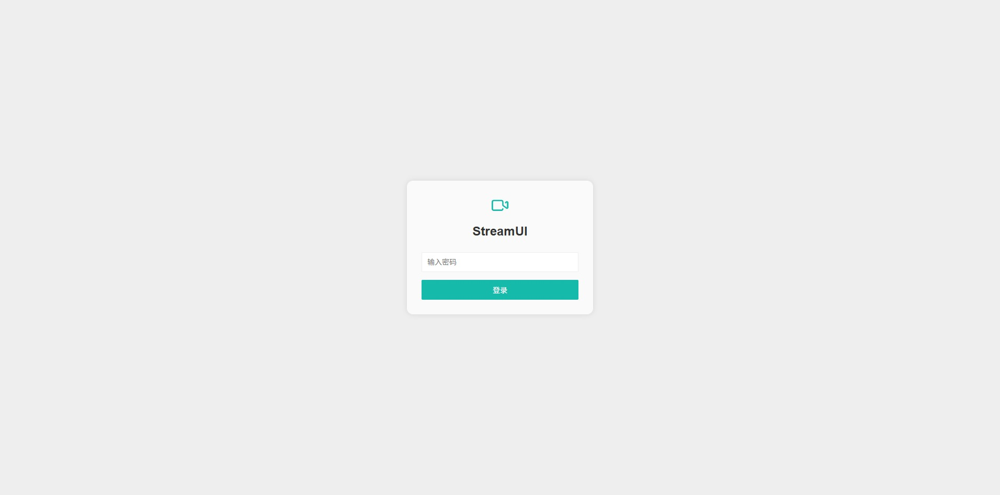
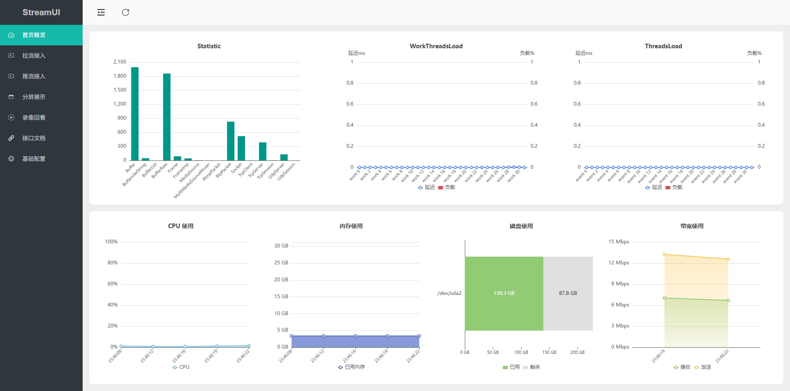
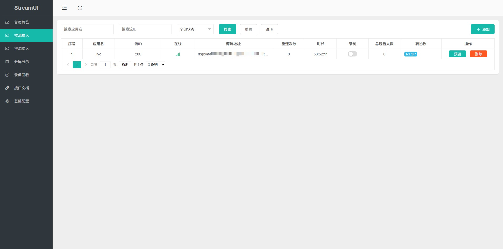
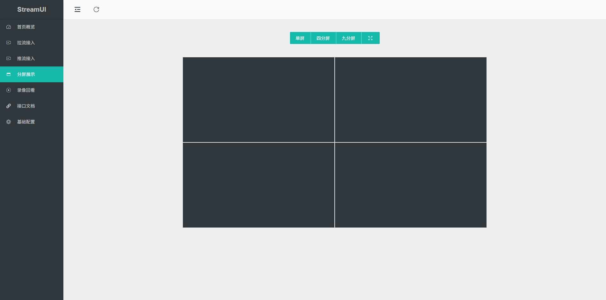
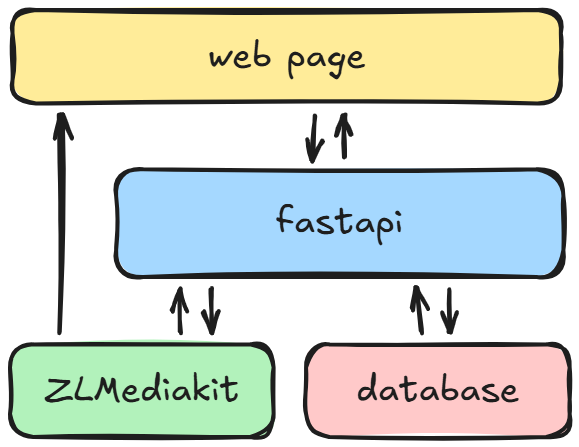

⚙️ 中文 | [English](./README_en.md)

<div align="center">
  
  <h1>管理平台</h1>
</div>

一个极简轻量的视频流媒体管理平台，开箱即用，易于扩展

> 管理平台以 [ZLMediaKit](https://github.com/ZLMediaKit/ZLMediaKit) 和 [Layui](https://github.com/layui/layui) 为基础。整体设计以蓝绿色（`#16baaa`）为主色调，秉持 “简洁、易用、可扩展” 的理念，在代码复杂度与功能实现之间不断权衡取舍，执着追求极简之美

### Features

✅ 支持 RTSP/RTMP/HLS/WebRTC/RTP/GB28181 等主流协议的拉流接入、拉流保存

✅ 支持 RTSP/RTMP/RTP 等协议的推流接入

✅ 支持接入流分发 RTSP/WebRTC/RTMP/FLV/HLS/HLS-fMP4/HTTP-TS/HTTP-fMP4 等协议

✅ 支持接入流 1x1、2x2、3x3 多屏播放

✅ 支持接入流本地录制、回放、下载、自动清理等功能

本平台重在流管理，暂不支持 ONVIF、GB28181 云台控制。GB28181 支持设备注册、保活、目录上报、主动目录查询及实时点播；实时点播需要设备实现标准 MPEG-PS/RTP 推流。

### GB28181 基础接入

平台可作为 GB28181 UDP SIP 注册端点，接收 `REGISTER`、Digest 鉴权、`Keepalive` 和 `Catalog`。系统服务安装默认启用，默认使用 UDP `5060`、平台 ID `34020000002000000001` 和 SIP 密码 `NSlb-3ggeg1JVXp4oFFeOJeGRyOc1pCO`：

```bash
sudo bash scripts/install_gsapp.sh --quick --zlm-mode existing
```

需要允许设备到平台的 UDP `5060`。管理员可在平台“国标接入”页修改 SIP 密码；修改后 LM700 的“国标接入”页必须填写相同密码。安装时也可使用 `--gb28181-password` 覆盖默认值。LM700 的平台地址填部署平台 IP，平台端口填 `5060`，本地 SIP 端口默认 `5062`，并填写设备 ID、高清通道 ID；可选配置标清通道和其本地媒体地址。保存后设备会注册、发送保活并上报通道目录。

平台“国标预览”页可查看目录、主动刷新目录、发起/停止点播。平台以 `INVITE -> 200 OK -> ACK` 建立 SIP 对话，并在 ZLMediaKit 确认 RTP 流上线后才装载播放器。LM700 使用 FFmpeg API 将 H.264/AAC 封装为 MPEG-PS 后通过 SDP 协商的 RTP 端口发送；每个 SIP `Call-ID` 使用独立的媒体 relay。部署前必须在真实 LM700 与 ZLMediaKit 上抓包验证 PS-RTP 互操作性。

### 远程提审

“远程提审”由两台 LM700 原生处理音视频：两端设备采集本机音视频、发布任务专属 RTMP 流、拉取对端流，并在本机硬解码显示及输出到聆讯扬声器。浏览器仅用于平台任务编排和状态查看，不参与采集。平台创建任务后，启动命令通过设备接入密钥下发；设备每 5 秒领取任务并回执 `ready`、`running`、`ended` 或 `failed`。

部署平台时必须设置设备可达的汇聚地址，例如 `STREAMUI_REMOTE_HEARING_RTMP_BASE=rtmp://192.168.0.110:1935`。该地址须由平台 ZLMediaKit 或专用内网 RTMP 汇聚服务提供，且允许两端 LM700 访问。每个任务自动生成不可预测的流前缀，流名为 `hearing/<prefix>_questioning` 和 `hearing/<prefix>_subject`；请在内网防火墙仅开放平台与授权设备所需的 RTMP 端口。

### Quick Start

此项目推荐使用 Docker Compose 部署

```shell
cd ./docker
docker compose up -d
```

运行后，打开浏览器并转到`http://{你的服务器 IP}`登录管理平台。

默认密码为`123456`，你可以在 [login.html](./frontend/login.html) 中更改它

### 脚本部署与更新

使用脚本安装的生产环境，常规代码更新可直接执行：

```bash
sudo bash scripts/install_gsapp.sh --zlm-mode existing
```

安装脚本会检查 `Nginx`、`FFmpeg`、Python 运行时和必要的 ZLMediaKit 编译依赖；已安装时会跳过 `apt-get update` 与系统包安装，仅同步应用文件并重启服务。若只需同步应用文件且现有虚拟环境完整，可使用更快的更新方式；该模式不会重启正在运行的 ZLMediaKit，避免中断实时视频：

```bash
sudo bash scripts/install_gsapp.sh --quick --zlm-mode existing
```

### 平台网页笔录（Tiptap）

案件详情中新建笔录固定使用平台网页笔录（Tiptap）。内置了从 LM700 模板目录转换的“讯问笔录、询问笔录、约谈笔录、犯罪嫌疑人诉讼权利义务告知书、行政案件权利义务告知书”；原 DOCX 的表格字段已转为可编辑行，并保留 `{{姓名}}`、`{{年龄}}`、`{{身份证号}}` 等字段占位符。创建笔录时系统自动填入 `{{case_no}}`、`{{case_name}}`、`{{session_no}}` 和 `{{date}}`，其余人员字段可在编辑器中填入或由后续身份证识别功能写入。

网页笔录工作台同时展示案件、会话、场所和参与人员资料；支持一键写入模板字段、成对插入问答、自动保存草稿、生成版本、打印和定稿。定稿前系统会校验未替换的模板字段、正文长度，以及讯问/询问笔录是否已有成对且已填写的问答；定稿后的版本以 HTML 快照、SHA-256 和案件审计链归档，不可修改。

### 离线部署

离线包必须在一台已完成平台部署、可联网的 Debian/Ubuntu 主机上生成；生成机与目标机必须使用相同的发行版版本、CPU 架构和 Python 大版本。离线包包含应用源码、Nginx/FFmpeg/Python 等 `.deb` 依赖、后端 Python wheels，以及当前机器已经运行的 ZLMediaKit 二进制和 Web 资源。

在线生成机执行：

```bash
cd /path/to/StreamUI
sudo bash scripts/create_offline_bundle.sh --output /tmp --platform gsapp
```

生成前需确认生成机的 `onlyoffice-documentserver` 已成功完成安装，并且 `/usr/share/package-data-downloads` 中保留安装时下载的字体 `.exe` 文件。生成器会校验这两个前提，缺失时会停止并提示原因。

生成的 `/tmp/gsapp-offline-*.tar.gz` 复制到离线机器。包名包含平台名、发行版代号和架构，例如 `gsapp-offline-jammy-amd64-20260804-120000.tar.gz`；ARM64 机器生成的包则为 `gsapp-offline-jammy-arm64-...tar.gz`。离线安装器会校验包完整性、目标机发行版代号、CPU 架构和 Python 主次版本，避免误用 AMD64/ARM64 包。

```bash
mkdir -p /tmp/gsapp-offline
tar -xzf /path/to/gsapp-offline-*.tar.gz -C /tmp/gsapp-offline
sudo bash /tmp/gsapp-offline/gsapp-offline-*/install_offline_gsapp.sh
```

默认离线安装会使用包内 `.deb` 安装 OnlyOffice Document Server 及其依赖，并使用包内字体缓存完成初始化；整个过程使用 `dpkg` 和 `apt-get --no-download`，不会访问网络或在线仓库。其余 Python、Nginx、FFmpeg 等系统组件默认不安装、升级或覆盖：系统已有组件时直接复用；缺少组件时，安装器会将离线包内的运行时解压到 `/opt/hongmsoft/runtime`，创建平台专用虚拟环境 `/opt/hongmsoft/softapp/backend/.venv`，并在缺少系统 Nginx 时启动平台私有的 `gsapp-nginx.service`。

只有已确认允许修改系统软件时，才在最后追加 `--install-system-deps`，使用离线包内的 `.deb` 补齐依赖：

```bash
sudo bash /tmp/gsapp-offline/gsapp-offline-*/install_offline_gsapp.sh --install-system-deps
```

安装后访问 `http://<离线机器IP>`。如需指定端口或 ZLMediaKit 密钥，可在最后一条命令后附加现有安装器参数，例如 `--http-port 80 --api-port 10801 --zlm-secret <密钥>`。

### Tips

首次启动后，建议先进入 [基础配置] 页面，根据业务需要修改配置

- 考虑开启按需转发，优点是节省带宽，缺点是第一个观众观看时，需要等待转发流启动

- 考虑关掉不需要转发的协议，比如不需要分发 RTMP 协议，就关掉 RTMP 转发

- 考虑开启 faststart，优点是播放时可以快速 seek，缺点是录制时需要多占用一些存储空间

- 考虑增大 GOP 缓存，优点是播放平滑，录制事件视频回溯时间变长，缺点是增大内存占用

更多选项深入研究请参考 ZLMediaKit 的 [配置](https://github.com/ZLMediaKit/ZLMediaKit/tree/master/conf)

### Snapshots

<table>
    <tr>
        <td ><center>登录页面</center></td>
        <td ><center>首页</center></td>
    </tr>
    <tr>
        <td ><center>拉流接入</center></td>
        <td ><center>分屏播放</center></td>
    </tr>
</table>

### Architecture

管理平台追求极简实现，前端未采用 Vue、React 等重量级框架，后端也避开了功能繁杂的 Java Spring 体系，转而选用轻量级的 Layui 与 FastAPI 组合，整体架构简洁清晰，易于理解和二次开发

代码结构如下所示

```bash
├── backend
│   ├── db  # 数据库目录
│   ├── main.py  # 接口
│   ├── scheduler.py  # 定时任务
│   └── utils.py  # 工具函数 
│
├── frontend
│   ├── assets  # 静态资源
│   ├── index.html  # 主页面
│   ├── login.html  # 登录页面
│   └── pages
│       ├── home.html  # 首页概览
│       ├── playback.html  # 录像回放
│       ├── pull-stream.html  # 拉流接入
│       ├── settings.html  # 基础配置
│       ├── push-stream.html  # 推流接入
│       └── wall.html  # 分屏展示
```

整体框架图如下所示

<p style="margin: 10px 0px" align="center">
  
</p>


你可以根据自己的需求，在这个平台的基础上添加新的功能或修改现有功能（如添加 ONVIF、GB28181 设备的识别、流接入、云台控制等）

### DVR 设备接入

管理员必须先在“设备管理”中预建设备，保存平台生成的设备接入密钥，然后在设备端配置平台地址、设备 ID 和该密钥。设备默认不允许接入，只有在平台设备列表中点击“启用接入”后，设备才能注册并发送心跳；停用接入会立即将设备标记离线并拒绝后续注册和心跳。平台会在 90 秒未收到心跳后将已启用设备标记为离线。接入密钥只在预建设备响应中返回一次，平台仅保存其哈希值。

```http
POST http://{平台IP}/api/device/register
Content-Type: application/json

{"device_id":"DVR-001","name":"前门 DVR","access_key":"首次可省略"}
```

预建设备时生成的 `access_key` 必须保存。后续心跳请求如下：

```http
POST http://{平台IP}/api/device/heartbeat
Content-Type: application/json

{"device_id":"DVR-001","access_key":"注册返回的密钥","metadata":{"version":"1.0","channels":8}}
```

设备推流地址在设备端“平台推流”页独立配置，例如 `rtmp://192.168.10.20:1935/live/DVR-001_hd`。平台设备注册仅用于接入认证和心跳状态管理；如需由平台主动接入设备视频，可在“拉流接入”中配置设备的 RTSP 地址。

在设备管理页可将 DVR 通道关联到平台流 ID，并配置按星期和时段执行的录像计划。远程设置使用 DVR 的管理网页地址；目标 DVR 必须对浏览器可达，并允许被 iframe 嵌入（未设置 `X-Frame-Options` 或 CSP `frame-ancestors` 限制）。

平台不接受设备自行创建记录；生产环境应设置随机且保密的 `STREAMUI_AUTH_SECRET`，以确保服务重启后会话可持续有效。

### 案件管理与设备档案

“设备管理 -> 案件管理”以案件为一级业务对象：平台创建案件后，将案件下发到一个或多个已启用设备。设备是办案终端和采集来源，不是案件目录根；一个案件可跨多个设备，一个设备也可处理多个案件。下发任务状态依次为“待接收、已接收、办理中、已完成”。

案件材料采用以下关系，不能以“设备目录”替代：

```text
案件 -> 办案会话（设备、场所、人员、起止时间）
  -> 笔录 -> 笔录版本 -> 定稿
  -> 同步录音 / 录像材料
  -> 审计记录
```

办案会话是笔录与同步音视频的唯一关联中心。上传笔录、录音或录像必须同时提供已下发案件的 `case_id` 和同设备的 `session_id`，平台会计算文件 SHA-256。笔录每次保存均生成版本；定稿后不能新增版本，关联源文件也不能改名、移动或删除。创建案件、下发、设备回执、会话状态、笔录版本、定稿及媒体登记均写入案件审计记录。

设备客户端使用接入密钥拉取自己的案件，不会看到其他设备的任务：

```http
GET http://{平台IP}/api/device/cases?device_id=DVR-001
X-Device-Access-Key: 设备接入密钥
```

设备收到后可回执状态：

```http
POST http://{平台IP}/api/device/case-assignments/{assignment_id}/ack
X-Device-Access-Key: 设备接入密钥
Content-Type: application/json

{"device_id":"DVR-001","status":"received"}
```

其中 `status` 可取 `received`、`handling` 或 `completed`。平台用户通过 `GET /api/cases/{case_id}` 查询案件全貌，包括已下发设备、办案会话、笔录及同步音视频；通过 `GET /api/cases/{case_id}/audit-logs` 查询审计轨迹。文件仍保存于 `backend/data/device_archives/<设备ID>/`，数据库保存案件、会话、文件元数据和 SHA-256，下载不会接受客户端提供的服务器路径。

管理员在案件页导入 DOCX 笔录模板后，平台保留原始 DOCX 和 SHA-256。已启用的 LM700 会在平台心跳成功后通过设备接入密钥调用模板清单和下载接口，仅下载新增或哈希变化的模板；设备未出现在平台清单中的本地导入模板会保留，供离线办案使用。

平台在设备接收案件后创建办案会话：`POST /api/cases/{case_id}/sessions`。设备客户端上传笔录或办案材料时，使用 `multipart/form-data` 调用下列接口。`case_id` 必须是已下发到该设备的案件，`session_id` 必须属于该案件且属于同一设备；`archive_type` 取 `transcript`、`document`、`audio` 或 `video`：

```http
POST http://{平台IP}/api/archives/upload

device_id=DVR-001
access_key=设备接入密钥
case_id=案件ID
session_id=办案会话ID
archive_type=transcript
status=in_progress
title=询问笔录
file=@询问笔录.docx
```

笔录文件上传后，平台创建笔录记录并以 `POST /api/transcripts/{transcript_id}/versions` 绑定上传文件；版本保存需要其 SHA-256。`POST /api/transcripts/{transcript_id}/finalize` 将笔录定稿。音视频文件可通过 `POST /api/case-sessions/{session_id}/media` 登记来源流、起止时间和 SHA-256。设备下载自身文件时调用 `GET /api/device/archives/{archive_id}/download?device_id=DVR-001`，并在请求头中传入 `X-Device-Access-Key: 设备接入密钥`。

案件材料的上传、平台或设备下载、删除请求都会写入案件审计哈希链；已经成为笔录版本或音视频证据的源文件不可修改、不可删除。

设备实际开始、结束办案时应回执已分配会话；开始会话会将设备任务推进为“办理中”：

```http
POST http://{平台IP}/api/device/case-sessions/{session_id}/status
X-Device-Access-Key: 设备接入密钥
Content-Type: application/json

{"device_id":"DVR-001","status":"active","occurred_at":"2026-08-02T10:00:00+08:00"}
```

`status` 仅允许按 `active -> ended` 单向流转。平台在办结案件前调用 `GET /api/cases/{case_id}/completion-report` 核验：全部设备任务已完成、所有办案会话已结束或取消、全部笔录已定稿、音视频已绑定原始文件，并且审计哈希链校验通过。仅管理员可调用 `POST /api/cases/{case_id}/close` 完成办结。

### 系统授权

在“系统维护”中可查看平台机器序列号并导入授权码。序列号由宿主机的 machine-id 和物理网卡 MAC 生成，格式为 `GS8-<机器特征码>-0001`；Docker 部署时会挂载宿主机 `/etc/machine-id`，因此重启容器不会改变序列号。

授权使用 RSA-3072、RSA-PSS 和 SHA-256 签名，许可证绑定产品 `GS8000` 和该机器序列号。私钥仅保存在离线签发环境的 `ComPrv/LicTools/license-keys/GS8000_private.pem`，不得复制到服务器或提交到代码仓库。签发时将系统维护页显示的完整序列号作为机器 SN：

```shell
./issue_license.sh ./license-keys/GS8000_private.pem GS8000 GS8-机器特征码-0001 ./archive/GS8000-license.json
```

脚本输出的 `LIC1:` 单行授权码可由管理员在“系统维护 -> 授权”中导入。平台仅内置公钥并在导入与每次查询状态时校验签名、产品、机器序列号和有效期。

### Thanks

- [ZLMediaKit](https://github.com/ZLMediaKit/ZLMediaKit)
- [Layui](https://github.com/layui/layui)
- [FastAPI](https://fastapi.tiangolo.com/)

🥰 Our project is now recommended by https://github.com/ZLMediaKit/ZLMediaKit

### License

This platform is licensed under the [MIT License](./LICENSE)
