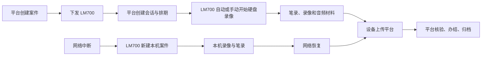
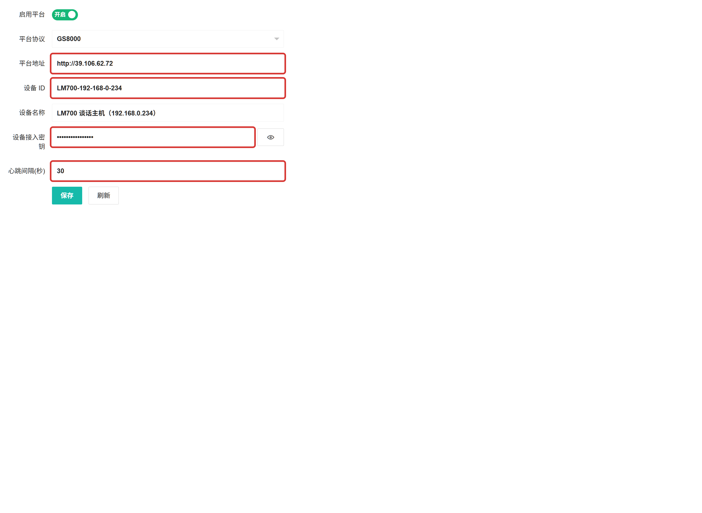
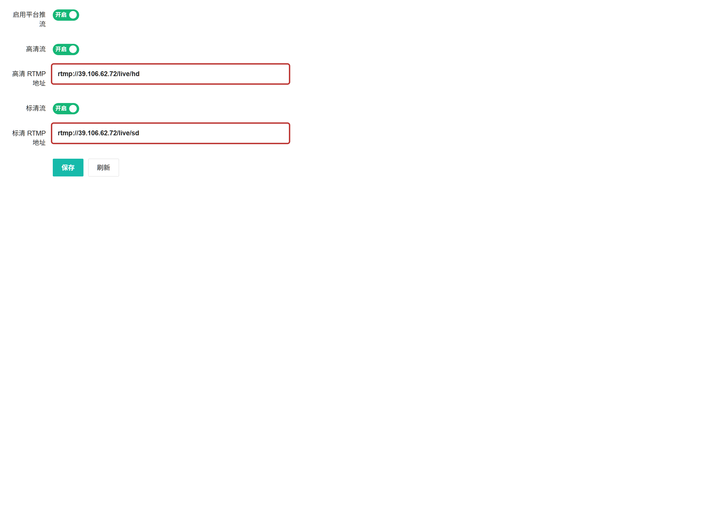
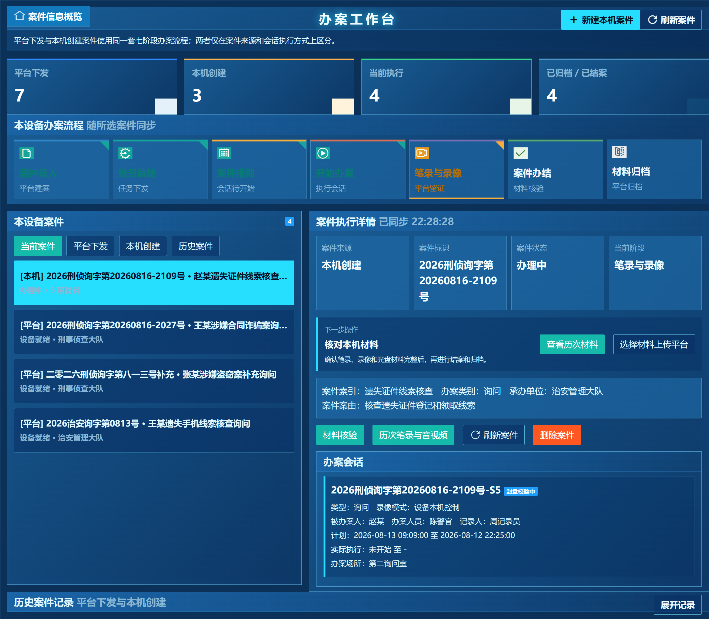

# 平台端与 LM700 离线办案操作手册

- 适用范围：GS8000 集中管理平台、LM700 谈话主机
- 演示平台：`http://39.106.62.72`
- 文档目标：完成设备接入、RTMP 推流、平台下发办案，以及网络中断时的设备本机离线办案、材料回传和平台归档。

## 1. 角色与流程

| 角色 | 主要职责 |
| --- | --- |
| 平台管理员 | 预建设备、创建并下发案件、创建会话和排期、核验材料、办结归档。 |
| 办案人员 | 在 LM700 上确认接入状态，按平台会话或本机离线案件开始录像与笔录，核对并上传材料。 |
| 运维人员 | 保证平台 HTTP、RTMP 和设备网络可达；处理设备离线、推流失败与材料上传失败。 |

**流程原则**

- 平台下发案件：平台是案件、会话和排期的权威来源；未到计划开始时间不得提前启动。
- 设备本机案件：网络中断时可独立创建、录像和制作笔录；恢复网络后再将选定材料上传平台。
- 录像模式为“硬盘录制”时不需要光盘操作。只有选择“硬盘+光盘同步录制”时才进入光盘刻录与校验流程。
- 录像、笔录和材料必须对应同一案件与会话。不要把历史案件材料上传到新案件。

## 2. 使用前检查

1. 平台浏览器能访问 `http://39.106.62.72`。
2. LM700 能访问平台 `80/TCP` 与 RTMP `1935/TCP`。
3. 平台“设备管理”中已经预建设备，记录设备 ID 和一次性生成的接入密钥。
4. 平台与 LM700 的系统时间均为中国标准时间（UTC+8）。
5. 开始平台排期前，确认 LM700 没有其他正在录像或刻录的任务。

> 接入密钥等同设备身份凭据。不得写入截图、会议纪要或非受控的聊天记录；泄露后应在平台重新生成并同步更新设备。

## 3. 平台登录与设备预建设

### 3.1 登录平台

打开 `http://39.106.62.72`，输入平台管理员账号密码并登录。

### 3.2 预建设备

在平台进入“设备管理”，新增或核对 LM700：

| 字段 | 填写规则 |
| --- | --- |
| 设备 ID | 与 LM700“平台配置”中的设备 ID 完全一致，例如 `LM700-192-168-0-234`。 |
| 设备名称 | 便于识别的名称，例如“LM700 谈话主机”。 |
| 设备地址 | 设备管理地址；平台需要发起自动录像控制时，必须能访问设备 `8070` 端口。 |
| 启用接入 | 必须开启。 |
| 接入密钥 | 预建设备后保存；设备端必须填写同一密钥。 |

保存后等待设备心跳。设备显示“在线”后再下发案件。

## 4. LM700 接入演示平台

在 LM700 的“软件配置 -> 平台配置”中填写并保存。红框为必须核对的字段。

| 红框字段 | 示例 / 规则 |
| --- | --- |
| 平台地址 | `http://39.106.62.72`。不要额外填写 `/api`。 |
| 设备 ID | 与平台预建设备 ID 完全一致。 |
| 设备接入密钥 | 使用平台预建设备时生成的密钥；截图中必须打码。 |
| 心跳间隔 | 推荐 `30` 秒，允许范围为 `10-3600` 秒。 |

**验证方法**：点击“保存”，等待一个心跳周期；回到平台“设备管理”，检查设备状态为在线、最近心跳时间刷新。若设备离线，先检查地址、设备 ID、密钥和防火墙。

## 5. 配置 LM700 向平台 RTMP 推流

在 LM700 的“软件配置 -> 平台推流”中开启平台推流、高清流和标清流，然后填写 RTMP 地址。

| 字段 | 演示配置 |
| --- | --- |
| 启用平台推流 | 开启 |
| 高清流 | 开启，`rtmp://39.106.62.72/live/hd` |
| 标清流 | 开启，`rtmp://39.106.62.72/live/sd` |

保存后，平台可在“实时预览”或“拉流接入”中核验 `live/hd`、`live/sd` 是否在线。若需要多台设备同时推流，必须使用不同的流名，例如 `live/LM700-01_hd`、`live/LM700-02_hd`，避免后推流覆盖先推流。

## 6. 平台功能说明与案件状态

### 6.1 案件管理页面功能

| 页面元素 | 用途 | 操作人 | 完成判据 |
| --- | --- | --- | --- |
| 案件录入 | 创建案件并立即指定目标设备 | 平台管理员 | 案件列表出现新记录。 |
| 设备接收 | 查看设备是否收到平台下发案件 | 平台管理员 | 接收状态由“待接收”变为“已接收”。 |
| 案件排期 | 进入案件工作台创建会话、设置起止时间 | 平台管理员 | 会话显示“待开始”，开始/停止命令已建立。 |
| 设备办理 | 查看进行中会话及回传证据 | 平台管理员、办案人员 | 会话状态显示“进行中”或“已结束”。 |
| 查询与状态筛选 | 按案件编号、名称、承办单位或状态定位案件 | 所有平台操作人员 | 列表只显示目标案件。 |
| 办案工作台 | 查看案件全貌并进行人工编排 | 平台管理员 | 可见会话、命令、材料和审计轨迹。 |

平台案件状态按以下顺序变化：`待下发 -> 已下发 -> 办理中 -> 已办结 -> 已归档`。设备接收、会话状态和材料回传均会记录在审计轨迹中。状态已进入“已归档”后，不应再添加会话或修改作为证据的源材料。

### 6.2 一次完整人工编排的准备清单

在点击“创建案件”前，办案人员应准备下列信息。建议在纸质受案登记或业务系统中核对后再录入，避免后续修改编号和人员信息。

| 信息 | 是否必填 | 填写说明 |
| --- | --- | --- |
| 目标设备 | 是 | 只能选择已启用设备；自动控制录像时，平台必须能到达其 `8070` 控制端口。 |
| 案件名称 | 是 | 用“人员 + 事项 + 办案类别”描述，例如“张某涉嫌合同诈骗案询问”。 |
| 案件编号 | 建议填写 | 全局唯一；不填写时由平台自动生成，但不利于与外部业务编号对照。 |
| 案件类型 | 是 | 刑事、行政或其他。 |
| 办案类别 | 是 | 谈话、询问、讯问、辨认或其他；会话类型默认继承此值。 |
| 承办部门、案由 | 建议填写 | 用于检索、归档和审计。 |
| 被办案人、办案人员、记录人 | 建议填写 | 会自动带入创建会话表单，仍可按实际会话修订。 |
| 办案地点、计划开始/结束 | 建议填写 | 时间使用中国标准时间；结束时间必须晚于开始时间。 |
| 笔录模板 | 是 | 从目标 LM700 已同步的模板中选择；没有模板时先处理设备模板同步。 |

## 7. 平台端详细操作：从建案到会话

### 7.1 创建并下发案件

1. 登录平台，选择左侧“案件管理”。
2. 点击“创建案件”。在“下发设置”选择**目标设备**与案件类型。
3. 在“案件信息”填写案件编号、办案类别、案件名称、案件索引、办案部门和案件案由。
4. 在“人员与安排”填写被问话人、记录人、问话人一/二及所属单位、办案地点、问话次数和预期时间。
5. 从“笔录模板”下拉框选择模板。列表为空时，不要提交；返回设备确认模板已经同步。
6. 点击“创建并下发”。系统提示成功后关闭窗口。
7. 在案件列表按编号查询，确认案件状态为“已下发”，并确认“已下发设备”栏显示目标 LM700。

**如果未能下发**：

- 状态为“待下发”：在该案件的操作栏点击“下发设备”，选择在线且已启用的 LM700 后提交。
- 已下发但设备未显示：进入“办案工作台 -> 查看设备接收”，先确认接收状态；设备端点击“刷新案件”。
- 不要重新创建同编号案件来解决接收延迟；这会导致编号冲突或重复材料。

### 7.2 核对设备接收

1. 在案件行点击“办案工作台”。
2. 点击“查看设备接收”。
3. 检查目标设备的“设备状态”“下发时间”“接收时间”。
4. 只有设备状态为“已接收”或“办理中”后，才可点击“创建会话并排期”。

| 接收状态 | 含义 | 人工动作 |
| --- | --- | --- |
| 待接收 | 平台已下发，设备尚未确认 | 检查设备在线状态，在设备端刷新案件。 |
| 已接收 | LM700 已获得案件基本资料 | 可以创建会话。 |
| 办理中 | 设备已将会话启动回执给平台 | 不再重复创建同一会话。 |
| 已完成 | 设备办理已完成 | 进入材料核验、办结和归档。 |

### 7.3 创建办案会话并排期

1. 在案件工作台点击“创建会话并排期”。
2. 选择谈话房间。选择房间后，设备下拉框会仅显示该房间可用且已接收案件的设备；不关联房间时直接选择已接收设备。
3. 填写会话编号。建议格式为“案件编号 + 第几次 + 类别”，例如“2026 刑侦询字第 001 号第一次询问”。留空时由平台自动生成。
4. 选择会话类型。应与实际办案方式一致：讯问、询问、辨认或其他。
5. 选择录像模式：无光盘演示或日常硬盘留存选择“仅硬盘录制”；只有确需同步刻盘时选择“光盘与硬盘同步录制”。
6. 填写计划开始与计划结束。两项必须同时填写，结束必须晚于开始；不要填过去时间。
7. 核对办案场所、被办案人、办案人员、记录人、主持人员和参与人员摘要。
8. 点击“创建会话”。返回工作台后，在“办案会话”页签确认会话状态为“待开始”。

### 7.4 会话字段使用说明

| 字段 | 填写规则 | 对后续功能的影响 |
| --- | --- | --- |
| 谈话房间 | 选择实际地点对应房间 | 用于房间占用、排期和关联设备筛选。 |
| 办案设备 | 选择实际录制的 LM700 | 决定平台控制目标与材料归属。 |
| 会话编号 | 同一案件内唯一 | 用于命令、笔录、录像与审计关联。 |
| 录像模式 | 硬盘或硬盘+光盘 | 决定启动/停止命令和是否进入光盘校验。 |
| 计划开始/结束 | 中国时间，开始早于结束 | 到点自动下发开始/停止命令。 |
| 参与人员摘要 | 可记录补充参与人员与事项 | 用于案件审计，不替代正式笔录。 |

### 7.5 计划执行、人工开始与人工停止

默认使用排期自动执行：到计划开始时系统创建并执行开始命令，到计划结束时执行停止命令。平台会阻止早于计划开始的启动，并拒绝已经超过计划结束的启动。

在授权的临时办案场景，平台管理员可在“办案会话”表格中点击“开始”或顶部“开始会话”。操作后必须切换到“设备命令”页签确认命令状态：

| 命令状态 | 含义 | 操作 |
| --- | --- | --- |
| queued | 已入队等待执行 | 等待并刷新工作台。 |
| succeeded | 设备已成功执行 | 核对会话转为“进行中”，并在设备预览页确认录像时间。 |
| failed | 设备拒绝或网络失败 | 查看“异常信息”，修复后使用“重新排期”或授权后重新发起。 |
| skipped / cancelled | 会话状态已变化或计划已替换 | 不要重复处理旧命令，查看当前会话的最新命令。 |

会话进行中时，点击“停止会话”会创建停止命令。硬盘模式成功停止后会话为“已结束”；光盘同步模式会先进入“封盘校验中”，必须在“光盘证据”页签确认校验完成后再视为结束。

### 7.6 重新排期

仅“待开始”的会话可重新排期。

1. 在“办案会话”表格定位目标会话，点击“重新排期”。
2. 填写新的未来开始、结束时间。
3. 点击“确认重新排期”。
4. 返回“设备命令”，确认旧计划命令已取消、新开始和停止命令为 `queued`。
5. 在设备工作台刷新案件，确认计划时间已更新。

不要通过删除、重建同名会话来调整时间；这会造成材料归属分裂。

## 8. 平台工作台页签：逐项核验方法

| 页签 | 显示内容 | 办案人员应做什么 |
| --- | --- | --- |
| 办案会话 | 会话类型、人员、地点、计划/实际时间、状态 | 核对编号、状态和实际开始/结束时间。 |
| 设备回传音视频 | 录像/录音、来源流、时间、完整性、SHA-256 | 确认存在真实文件，时间范围与会话一致。 |
| 光盘证据 | 光驱、刻录状态、进度、主哈希、校验哈希 | 仅光盘模式使用；进度未到 100% 不得归档。 |
| 设备命令 | 开始/停止命令、时间、尝试次数、异常信息 | 发生自动启动或停止异常时首先查看此页。 |
| 设备回传资料 | 笔录、录像、录音、附件及 SHA-256 | 预览或下载抽查；确认标题中可识别案号和材料类型。 |
| 审计轨迹 | 创建、下发、接收、会话、上传、归档动作 | 用于追溯谁在何时执行何种操作。 |

**人工核验顺序**：先看“办案会话”是否已结束，再看“设备命令”是否全部成功，再看“设备回传音视频”和“设备回传资料”是否齐全，最后检查“审计轨迹”。任一项异常时不应办结归档。

## 9. LM700 设备端功能说明与详细操作

设备端办案工作台显示平台下发案件、本机创建案件和七阶段流程。

### 9.1 工作台区域与按钮

| 区域/按钮 | 用途 | 使用时机 |
| --- | --- | --- |
| 当前案件 | 同时展示需要继续处理的本机与平台案件 | 日常办案。 |
| 平台下发 | 只看平台发来的案件 | 核验接收、排期和会话。 |
| 本机创建 | 只看脱网时创建的离线案件 | 网络恢复前后核对本地材料。 |
| 历史案件 | 查询已办结或已归档记录 | 调阅，不作为新材料上传来源。 |
| 刷新案件 / 刷新会话 | 从平台重新拉取案件和会话 | 平台刚下发、刚排期或刚开始/结束后。 |
| 进入预览控制 | 打开音视频画面和硬盘录像控制 | 平台会话开始后或需要授权人工录制时。 |
| 在线笔录 / 继续笔录 | 按绑定模板制作笔录 | 办案过程中。 |
| 材料核验 | 检查案件、模板、会话和设备状态 | 停止录像后、上传前。 |
| 历次笔录与音视频 | 汇总本案本机材料 | 上传前逐项核对。 |
| 选择材料上传平台 | 将本机材料上传到当前平台 | 网络恢复、材料确认无误后。 |

### 9.2 执行平台下发案件

1. 点击“平台下发”，选中目标案件。
2. 核对“案件来源”为平台下发，“案件标识”为正确案号，“当前阶段”为案件排期或开始办案。
3. 在“办案会话”区域核对会话类型、录像模式、被办案人、办案人员、记录人、计划时间和地点。
4. 到计划开始后点击“刷新案件”。会话为“进行中”时，系统应自动跳转到预览控制。
5. 在预览控制页确认“正在录像”、开始时间和录像时长持续变化。
6. 录像期间制作笔录。不要从另一案件打开笔录模板，也不要切换到不相关本机案件。
7. 到计划结束后，等待平台停止录像；刷新工作台，确认会话为“已结束”。

### 9.3 授权人工开始硬盘录像

适用条件：已到会话计划开始时间、平台已创建会话，但需要由现场人员手动启动。若会话尚未到计划开始时间，平台会拒绝状态回执，不能以设备手工录像替代平台会话。

1. 在正确的平台下发案件详情点击“进入预览控制”。
2. 核对页面地址或案件状态区显示的案件编号、会话编号和录像模式。
3. 点击“手动开始录制”。
4. 看到按钮变为“正在录像”、开始时间出现、录像时间递增后，返回或刷新案件工作台。
5. 平台工作台的“办案会话”与“设备命令”应显示进行中/已执行；若未变化，记录设备开始时间并联系平台管理员核对会话状态。

**停止规则**：优先由平台停止。确需人工停止时点击“停止录像”，再确认按钮恢复“开始录像”。停止后不得立即删除本机录像或关闭案件，应先核验材料。

### 9.4 设备端笔录与材料核验

1. 选择案件后点击“在线笔录”或“继续笔录”。
2. 确认打开的模板与办案类别一致，填写问答、记录人和必要事项。
3. 保存并退出后点击“历次笔录与音视频”。
4. 核对每项材料的会话号、文件名、创建时间和文件大小；笔录、录像和音频应属于当前案件。
5. 点击“材料核验”。若提示设备仍在录像或刻录，先按会话状态完成停止或等待校验，不能上传不完整材料。

## 10. 设备离线办案：完整人工操作

离线办案用于平台网络不可用，但 LM700 本地硬盘、摄像头和笔录模板仍可使用的情况。离线案件与平台下发案件不同：它先只存在设备上，平台不会在离线期间显示其“已接收”“办理中”或“已归档”。

### 10.1 新建离线案件

1. 在设备工作台点击“新建本机案件”。
2. 输入唯一案件编号。建议前缀加 `OFFLINE-` 或当天日期，避免与平台已有案号冲突。
3. 填写案件名称、类别、承办单位、被办案人、办案人员、记录人、地点及笔录模板。
4. 保存后在“本机创建”列表选中该案件，检查来源显示“本机创建”。

### 10.2 进行离线录像和笔录

1. 点击“进入预览控制”。
2. 确认当前无其他录像、刻录任务；如有正在进行的未知任务，不要直接停止，应先确认归属。
3. 点击“开始录像”，确认按钮变为“正在录像”、时长开始增长。
4. 使用“在线笔录”创建或继续笔录；办案中可按需补充笔录。
5. 办理结束时点击“停止录像”，等待按钮恢复“开始录像”。
6. 回到工作台点击“材料核验”和“历次笔录与音视频”，确认本案材料数量、时间和名称正确。

### 10.3 网络恢复后的材料上传

1. 先在“平台配置”确认平台地址、设备 ID、密钥和心跳开启；等待设备显示平台同步成功。
2. 在设备工作台选择正确的本机案件，点击“选择材料上传平台”。
3. 在材料清单只勾选本次案件产生的笔录、录像、录音和附件；不要勾选历史案件文件。
4. 提交上传，等待成功提示。若出现待重试任务，不要重新复制或改名文件，使用“重试上传”。
5. 到平台按案件号查询，打开工作台的“设备回传资料”，核对上传数量和 SHA-256。
6. 平台管理员创建/核对对应会话、完成材料归属检查后，才可办结归档。

## 11. 办结、归档与回放操作

### 11.1 办结前的四项核对

| 核对项 | 通过标准 | 不通过时处理 |
| --- | --- | --- |
| 会话 | 已结束；开始、结束时间合理 | 检查设备命令和设备工作台。 |
| 录像 | 有真实录像条目、文件大小和哈希 | 没有文件则不能以“已录像”结案。 |
| 笔录 | 当前案件的笔录版本可下载/预览 | 回设备检查模板保存或重新上传。 |
| 审计 | 创建、下发、接收、开始、停止、上传记录连续 | 记录缺失时先查命令或网络异常。 |

### 11.2 归档

1. 确认案件状态为“已办结”。
2. 回到案件列表，在操作栏点击“归档”。
3. 提交后状态变为“已归档”。
4. 再次打开工作台，在“设备回传资料”中抽查笔录、录像和附件下载或预览。
5. 在“录像回看”检索案件对应时间范围。仅当存在真实文件时，才将回放结果记录为通过。

归档后不得修改已作为证据的源文件、哈希或版本。发现材料错误时，应按业务制度新建补正材料和审计记录，而不是覆盖旧归档文件。

## 12. 异常处理手册

| 现象 | 先看哪里 | 标准处理 |
| --- | --- | --- |
| 设备离线 | 平台设备管理、LM700 平台配置 | 核对地址、设备 ID、密钥和心跳；确认 `80/TCP` 可达。 |
| 设备收到案件但没有会话 | 平台“查看设备接收” | 设备接收后，平台必须点击“创建会话并排期”。 |
| 到点没有自动录像 | 平台“设备命令”、LM700 服务状态 | 查看开始命令错误；硬盘录像任务可由平台先停止后重启；未知光盘刻录不得强行中断。 |
| 自动停止后按钮未复位 | 预览控制页 | 刷新页面；页面会读取设备运行状态同步按钮。 |
| 需要变更时间 | 平台办案会话 | 使用“重新排期”，不要删除重建。 |
| 平台没有收到离线材料 | 设备待重试上传、平台回传资料 | 恢复网络后重试上传；保留设备本机原文件。 |
| 回放为空或大小为 0 | 平台回传音视频、录像回看 | 不能宣称已录像；核对设备实际录制和媒体绑定。 |
| 平台无法控制公网设备 | 网络与设备地址 | 平台必须通过 VPN/专线或端口映射到设备 `8070`；仅设备能访问平台不足以自动控制录像。 |

## 13. 单案人工编排记录单

每办理一案，建议由平台管理员和设备办案人员共同填写以下记录：

| 项目 | 记录 |
| --- | --- |
| 案件编号 / 名称 |  |
| 目标 LM700 / 设备 ID |  |
| 会话编号 / 类型 |  |
| 录像模式 |  |
| 计划开始 / 结束 |  |
| 实际开始 / 结束 |  |
| 开始、停止命令状态 |  |
| 笔录文件名 / 哈希 |  |
| 录像文件名 / 哈希 |  |
| 材料核验人 / 时间 |  |
| 归档人 / 时间 |  |
| 异常及处置 |  |

## 14. 最终交接检查单

- [ ] 平台地址可访问，管理员账号可登录。
- [ ] LM700 平台接入已启用，设备 ID 与接入密钥匹配。
- [ ] 平台设备状态为在线，心跳时间持续更新。
- [ ] 高清、标清 RTMP 地址正确，平台能看到预期流。
- [ ] 平台下发案件能在 LM700“平台下发”列表出现。
- [ ] 设备接收状态变为“已接收”后才创建会话。
- [ ] 会话计划时间、人员、地点和录像模式已核对。
- [ ] 自动开始、停止命令均在平台“设备命令”中成功。
- [ ] LM700 录像时长增长，停止后按钮恢复“开始录像”。
- [ ] 笔录、录像、录音均在“历次笔录与音视频”中核对。
- [ ] 离线本机案件可创建、录像、制作笔录并在网络恢复后上传。
- [ ] 平台能核验材料、办结归档，并且仅对真实存在的录像提供回看。